## Linux Systems Administration

### Step 1: Ensure/Double Check Permissions on Sensitive Files

1. Permissions on `/etc/shadow` should allow only `root` read and write access.

    - Command to inspect permissions:
 &nbsp;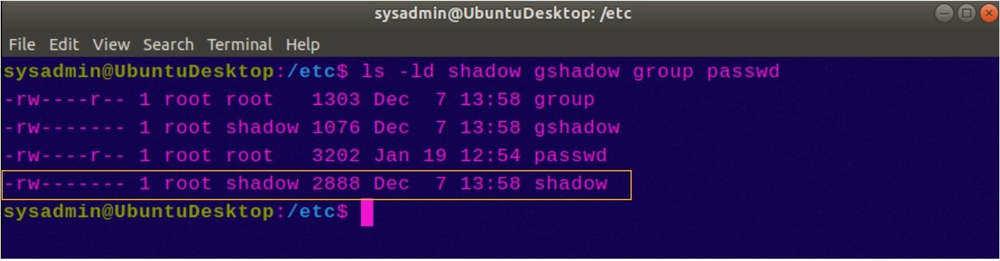&nbsp;
    - Command to set permissions (if needed):

2. Permissions on `/etc/gshadow` should allow only `root` read and write access.

    - Command to inspect permissions:
&nbsp;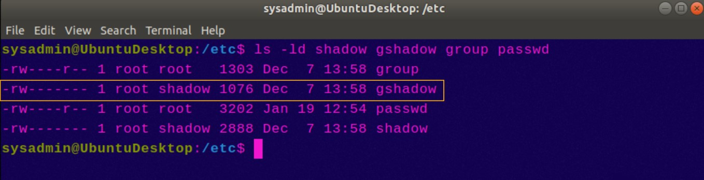&nbsp;
    - Command to set permissions (if needed):

3. Permissions on `/etc/group` should allow `root` read and write access, and allow everyone else read access only.

    - Command to inspect permissions:
&nbsp;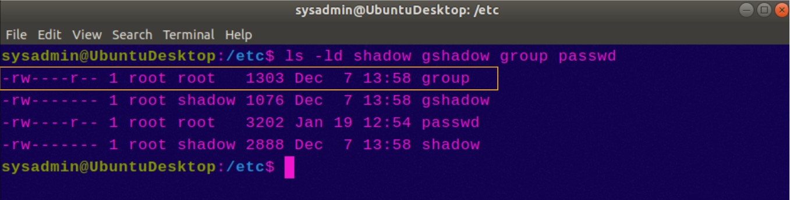&nbsp;
    - Command to set permissions (if needed):

4. Permissions on `/etc/passwd` should allow `root` read and write access, and allow everyone else read access only.

    - Command to inspect permissions:
&nbsp;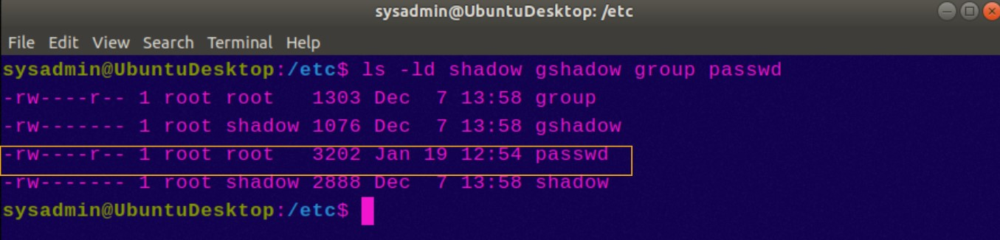&nbsp;
    - Command to set permissions (if needed):

### Step 2: Create User Accounts

1. Add user accounts for `sam`, `joe`, `amy`, `sara`, and `admin`.

    - Command to add each user account (include all five users):
&nbsp;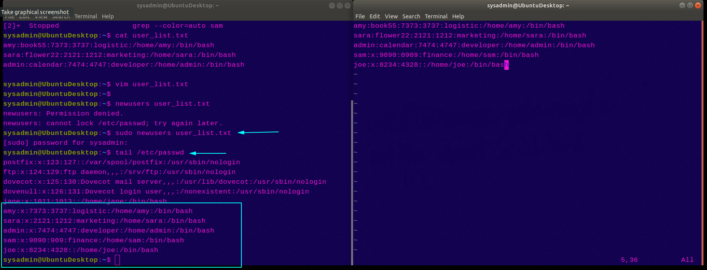&nbsp;
2. Ensure that only the `admin` has general sudo access.

    - Command to add `admin` to the `sudo` group:
&nbsp;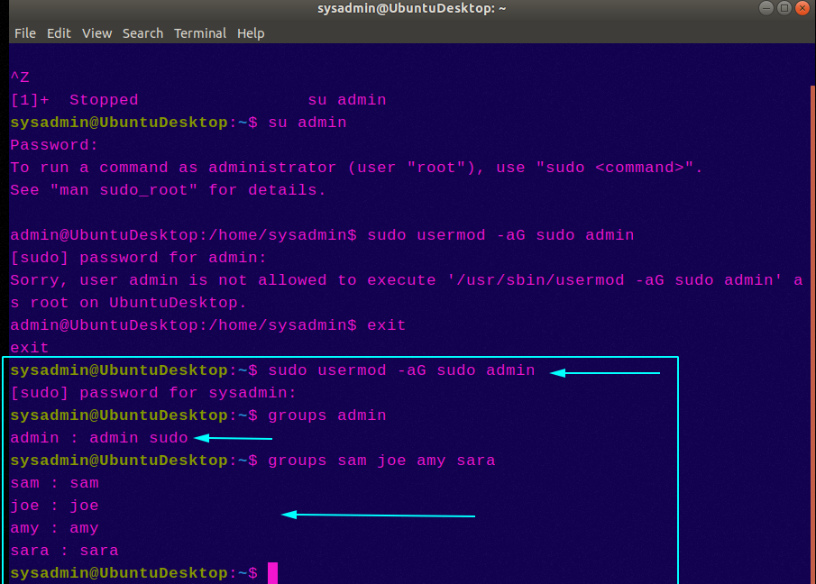&nbsp;
### Step 3: Create User Group and Collaborative Folder

1. Add an `engineers` group to the system.

    - Command to add group:
&nbsp;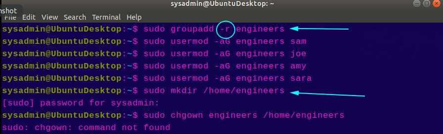&nbsp;
2. Add users `sam`, `joe`, `amy`, and `sara` to the managed group.

    - Command to add users to `engineers` group (include all four users):
&nbsp;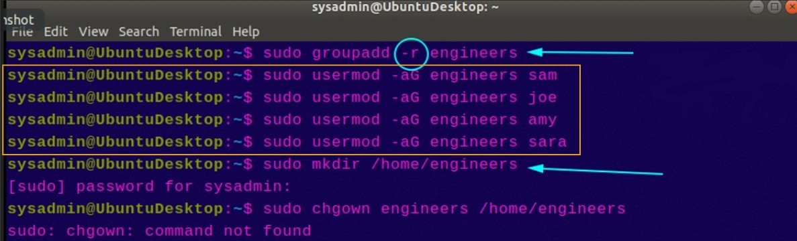&nbsp;
3. Create a shared folder for this group at `/home/engineers`.

    - Command to create the shared folder:
&nbsp;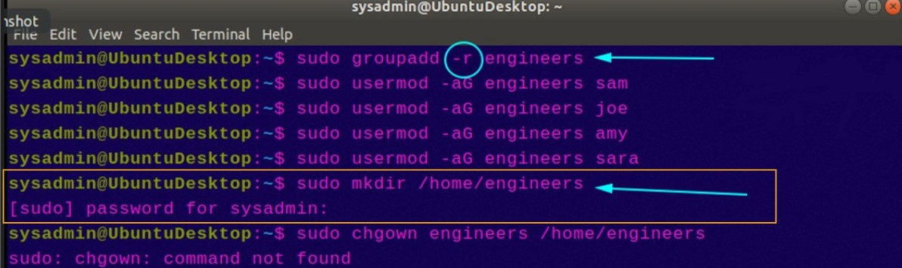&nbsp;
4. Change ownership on the new engineers' shared folder to the `engineers` group.

    - Command to change ownership of engineer's shared folder to engineer group:
&nbsp;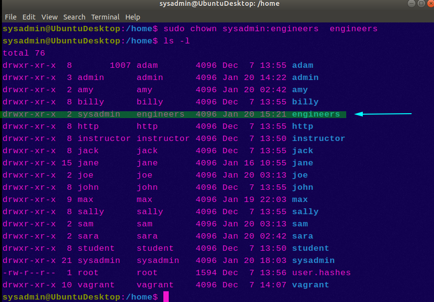&nbsp;
### Step 4: Lynis Auditing

1. Command to install Lynis:
&nbsp;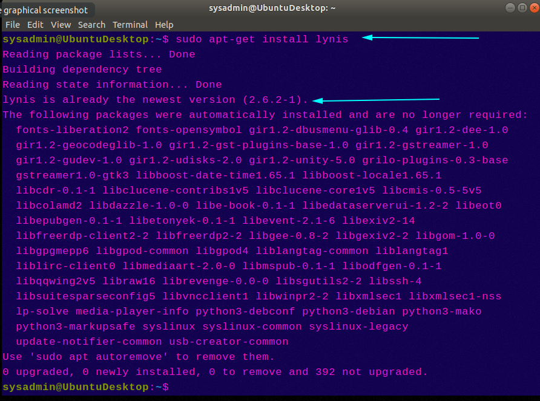&nbsp;
2. Command to see documentation and instructions:
&nbsp;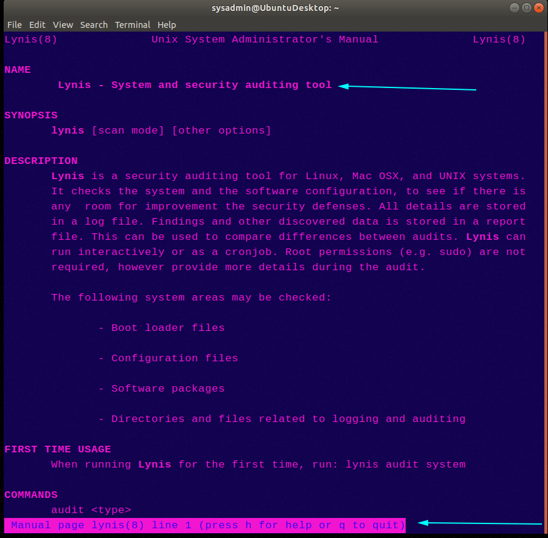&nbsp;
3. Command to run an audit:
&nbsp;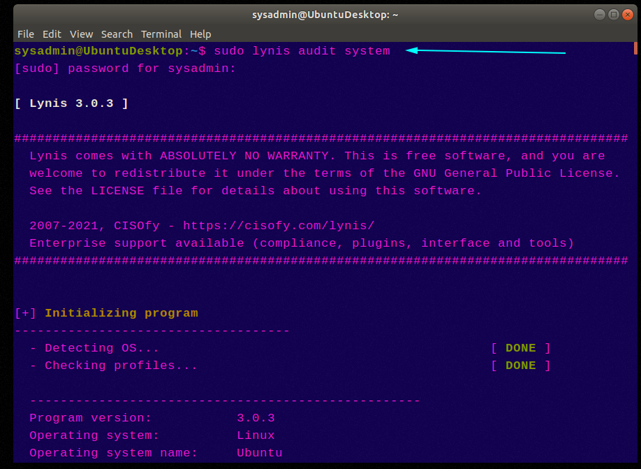&nbsp;
4. Provide a report from the Lynis output on what can be done to harden the system.

    - Screenshot of report output:
&nbsp;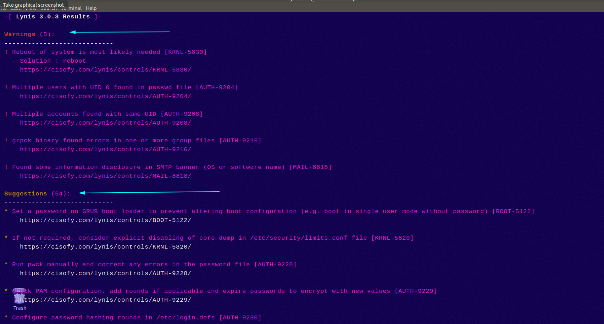&nbsp;
&nbsp;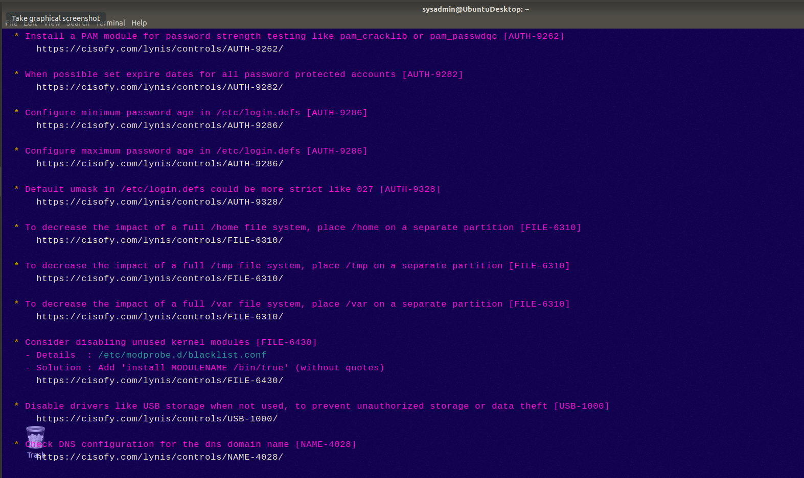&nbsp;
&nbsp;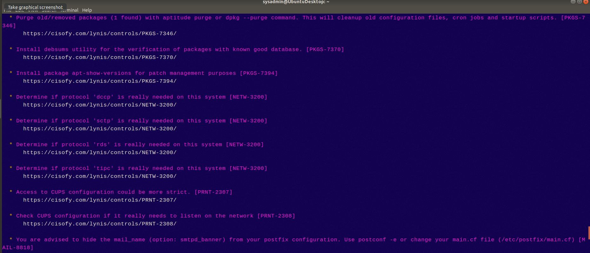&nbsp;
&nbsp;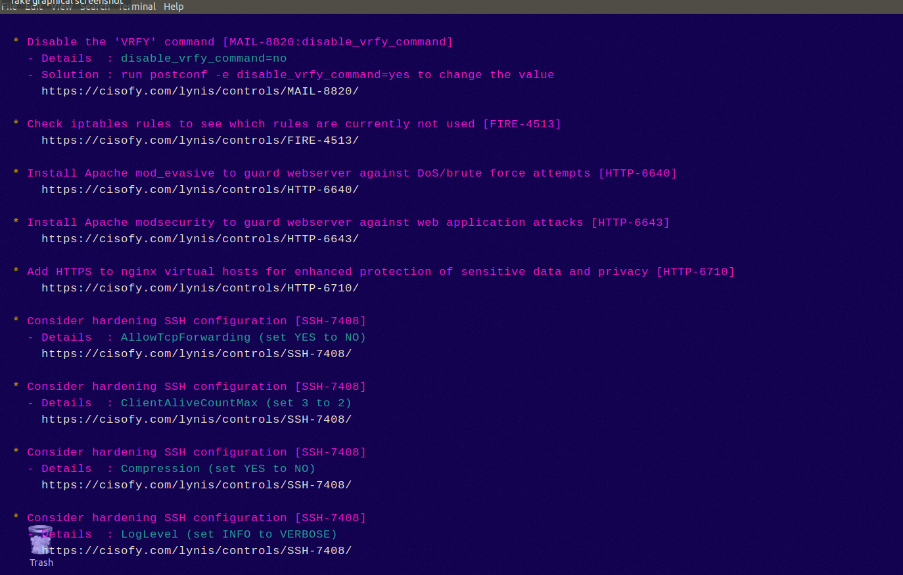&nbsp;
&nbsp;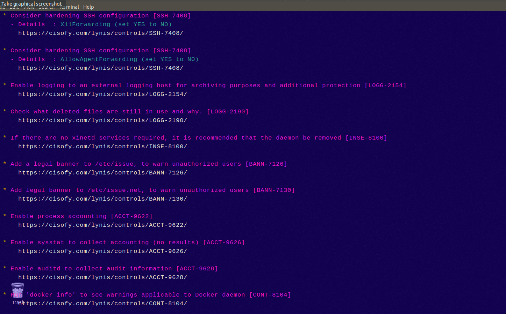&nbsp;
### Bonus
1. Command to install chkrootkit:
&nbsp;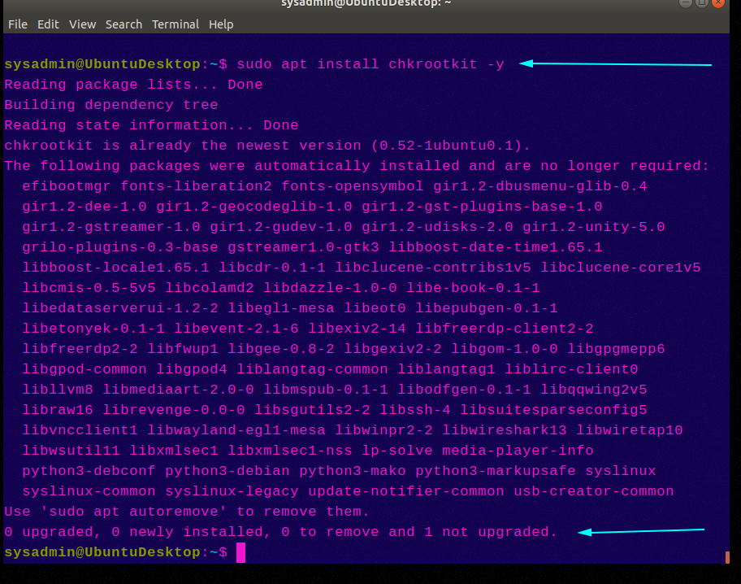&nbsp;
2. Command to see documentation and instructions:
&nbsp;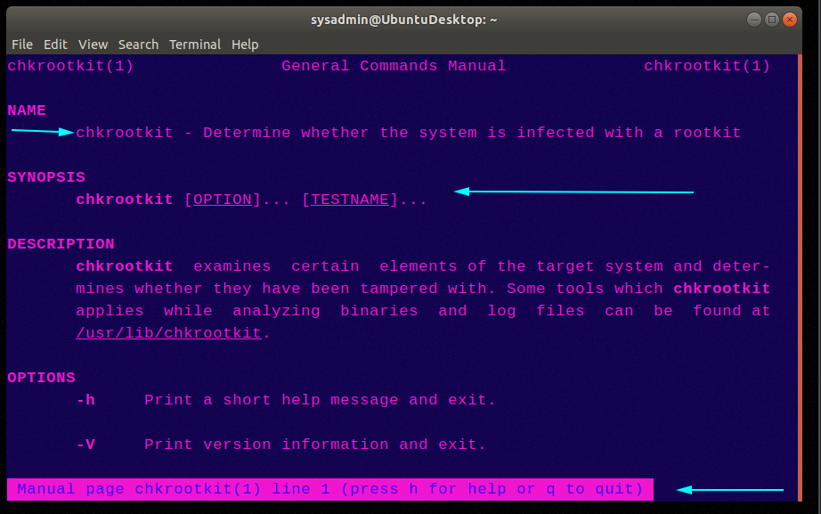&nbsp;
3. Command to run expert mode:
&nbsp;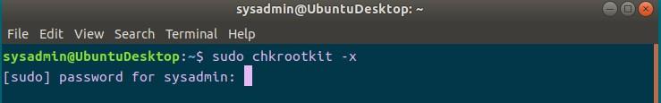&nbsp;

---

